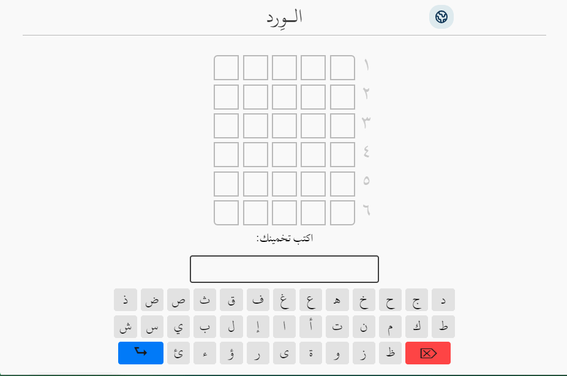

# PolyWordle

A multilingual customizable clone of the popular online word game, Wordle.
Built with React 18, styled-components, and Vite.

In Wordle, users have 6 attempts to guess a 5-letter word. You're helped along the way by ruling out letters that aren't in the word, and being told whether the correct letters are in the correct location or not.

### [Play Here](https://polywordle.vercel.app/)

## Features

- Play in English or Arabic, with UI translation as well as game localization (changing the language changes the wordlist and resets the game)
  

- Type with a text input or a visual keyboard
- Smooth animations on guess submit
