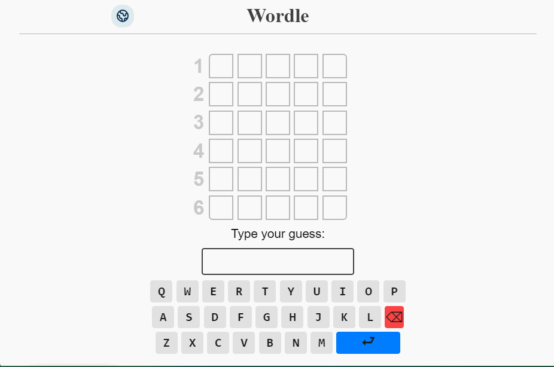

# PolyWordle

A bilingual customizable clone of the popular online word game, Wordle.
Built with React 18, TypeScript, styled-components, and Vite.

In Wordle, users have 6 attempts to guess a 5-letter word. You're helped along the way by ruling out letters that aren't in the word, and being told whether the correct letters are in the correct location or not.

### [Play Here](https://polywordle.vercel.app/)

## Features

- The UI is translated to Arabic, and the game is localized as well. You can play in either language
- When changing languages, the game will restart with a different wordlist
- You can type with a text input or a visual keyboard
- You can change the number of attempts to tweak the difficulty
- You can change the number of letters in the word which will change the wordlist
- You can reset the game at any time
- Smooth transitions and animations on every action
- Mobile-friendly
- Sound effects for different actions which can be muted
